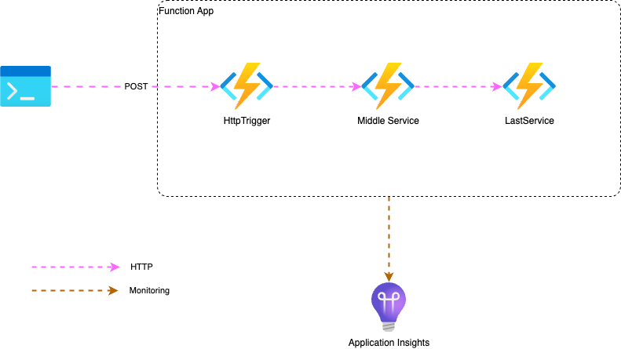
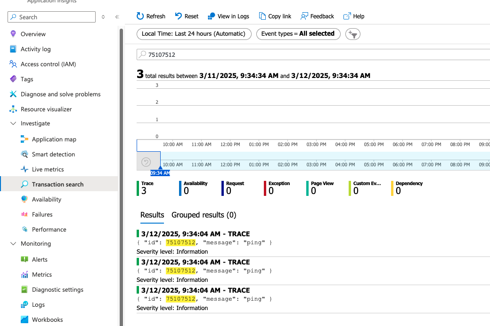

# Azure Functions end to end traceability with Application Insights
This demo demonstrates how to monitor an Azure Function app keeping context traceability between difference functions.

# Prerequisites
 - Azure Subscription
 - Visual Studio Code
 - Azure Function extension
 - Azurite extension (to run local)

# Setup

1. Clone this repo
2. Open the local folder in VSCode
3. Start Azurite Blob Service
5. Run it using F5
6. Send HTTP POST to the HttpTrigger function with the following payload:

    {
        "id": "75107512",
        "message": "ping"
    }

8. Confirm in the terminal that each function processed the message without any errors
9. Using Azure Extension, deploy it to Azure making sure you configure Application Insights in your function app
10. Once deployed, adjust environment variables as follows:

    "AzureWebJobsStorage": "STORAGE ACCOUNT",
    "FUNCTIONS_WORKER_RUNTIME": "dotnet-isolated",
    "MIDDLE_SERVICE_URL": "MIDDLE SERVICE FUNCION ENDPOINT WITH KEY",
    "LAST_SERVICE_URL": "LAST SERVICE ENDPOINT WITH KEY"

11. Repeat step 6 using HttpTrigger function endpoint
12. Go to Application Insights > Investigate > Transaction search and search for the id you have sent in the payload: 75107512 (consider it can take a feel seconds for the traces show up in the Appplication Insights)

    

13. Click in any of the traces to open the "End-to-end" transaction view and notice that, despite the fact it was processed by different functions, you can have an integrated view from the first trace to the last in the same view, and the reason is that the SDK used the same operation id for every event in this context, respecting all the settings in the host.json:

    

# Troubleshooting

**Problem**: When I try to deploy to Azure, it fails with error "Error: Key based authentication is not permitted on this storage account"

**Solution**: Go to the storage account used by your function app > Settings > Configuration > set Enabled in "Allow storage account key access" setting

**Problem**: The exection of any of the functions result in 404 not found

**Solution**: Make sure the environment variables are set with the correct URLs.